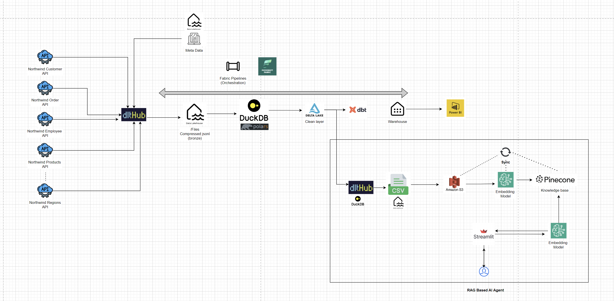

# Fabric dlthub Series

🚀 How to Build End-to-End Analytics in Microsoft Fabric—Without Spark 🔥
This is a series exploring what's possible without Spark in Microsoft Fabric. 

Week 1: Setting up ingestion with MS Fabric, dltHub, and Lakehouse.

https://sketchmyview.substack.com/p/setting-up-ingestion-with-ms-fabric